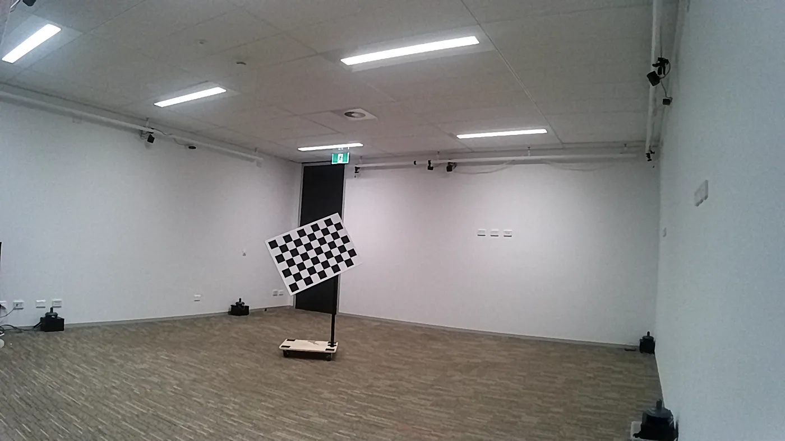
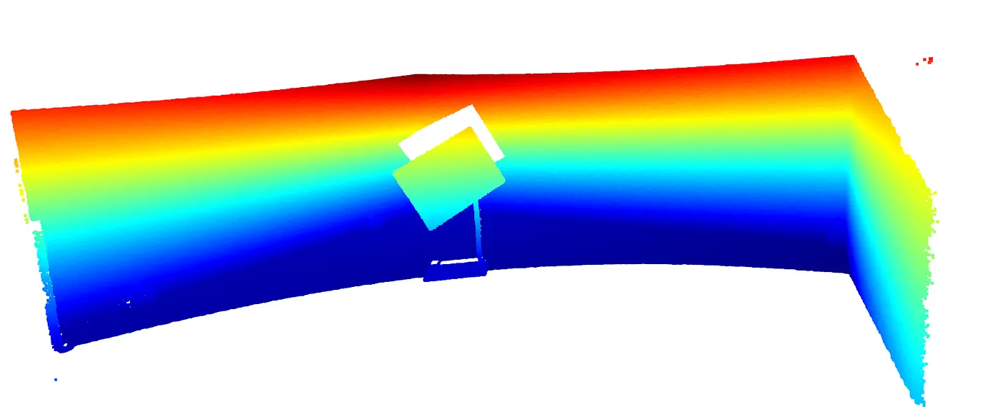
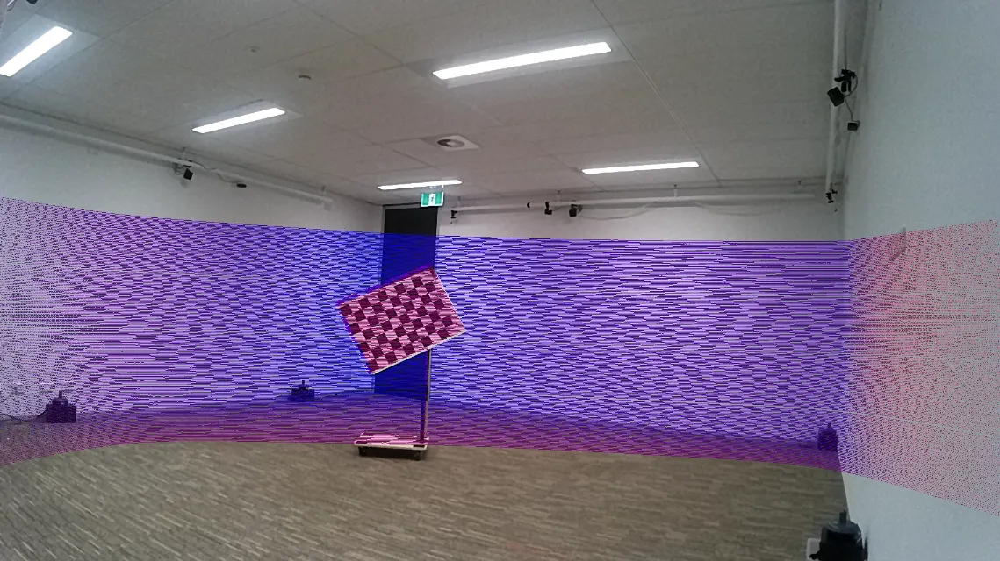
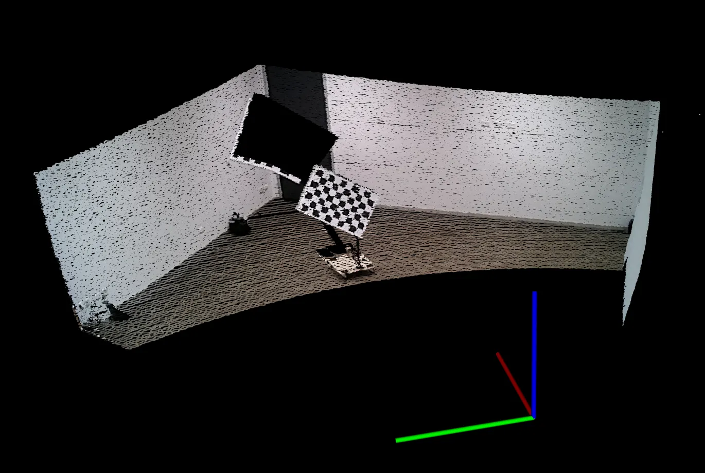

# LiDAR-Camera Calibration

This repository provides a tool for calibrating a LiDAR sensor with a camera. The calibration process involves finding the transformation matrix that aligns the LiDAR point cloud with the camera image. This is useful for applications such as sensor fusion, autonomous driving, and robotics.

## Features

- Extracts planes from LiDAR point clouds and camera images.
- Optimizes the transformation matrix using plane correspondences.
- Projects LiDAR points onto the image plane for visualization.
- Supports PCL, OpenCV, and Eigen libraries.

## Setup Instructions

### Dependencies

The project requires the following libraries:

- [PCL (Point Cloud Library)](https://pointclouds.org/)
- [OpenCV](https://opencv.org/)
- [Eigen](http://eigen.tuxfamily.org/)

### Building the Project

1. Clone the repository:
   ```sh
   git clone https://github.com/ayman-kamruddin/LiDAR-Camera-Fusion.git
   cd LiDAR-Camera-Fusion
   ```
2. Make sure that the checkerboard features and filter dimensions are implemented correctly in the .cpp files, which you should review before running. Also change CMakeLists.txt according to your system setup.

3. Create a build directory and navigate to it:
   ```sh
   mkdir build
   cd build
   ```

4. Run CMake to configure the project:
   ```sh
   cmake ..
   ```

5. Build the project:
   ```sh
   make
   ```

## Usage Instructions

1. Prepare your calibration data:
   - Place your checkerboard images in a directory named `images`.
   - Place your corresponding LiDAR point clouds in a directory named `pointclouds`.

2. Run the calibration:
   ```sh
   ./lidar_camera_calibration <path_to_calibration_data>
   ```

3. The transformation matrix will be saved to `transformation.yaml`.

4. The projected LiDAR points onto the image will be saved as `projected_points.jpg`.

5. The complete calibration parameter set, required to reproduce fused images or colored pointclouds, will be saved as `calibration_parameters.json`.

## Demo Results

The following examples show the full visual output of the calibration workflow, starting from raw sensor inputs and ending with fused representations.

Raw RGB image:

This is the original camera frame used as the visual reference for calibration. Checkerboard corners and image-plane geometry are extracted from this view.



Raw LiDAR point cloud:

This is the uncolored point cloud captured by the LiDAR sensor before fusion. Planar structures from this cloud are used to estimate geometric constraints.



Fused camera-LiDAR image:

After calibration, LiDAR points are projected into the camera image using the estimated extrinsic transformation. Correct alignment indicates accurate cross-sensor registration.



Fused colored point cloud:

Each LiDAR point is assigned color from the corresponding camera pixel after projection. This produces a colorized 3D reconstruction that visually validates the fusion quality.



## Repository Structure

- `src/`: Contains the source code files.
  - `main.cpp`: Entry point of the application.
  - `CalibrationHandler.cpp`: Handles the calibration process.
  - `CloudHandler.cpp`: Handles LiDAR point cloud processing.
  - `DataLoader.cpp`: Loads image and point cloud pairs.
  - `ImageHandler.cpp`: Handles image processing.
  - `Optimization.cpp`: Optimizes the transformation matrix.
  - `Projector.cpp`: Projects LiDAR points onto the image plane.

- `include/`: Contains the header files.
  - `CalibrationHandler.h`: Header for `CalibrationHandler.cpp`.
  - `CloudHandler.h`: Header for `CloudHandler.cpp`.
  - `DataLoader.h`: Header for `DataLoader.cpp`.
  - `ImageHandler.h`: Header for `ImageHandler.cpp`.
  - `Optimization.h`: Header for `Optimization.cpp`.
  - `Projector.h`: Header for `Projector.cpp`.

- `CMakeLists.txt`: CMake configuration file.

## Contributing

Contributions are welcome! Please follow these guidelines:

1. Fork the repository.
2. Create a new branch for your feature or bugfix.
3. Commit your changes with a descriptive message.
4. Push your branch to your forked repository.
5. Create a pull request to the main repository.

For any issues or questions, please open an issue on GitHub.

You can also check out the accompanying Medium.com [post](https://medium.com/@aymanbinkamruddin/lidar-camera-calibration-in-c-01046be829db).
